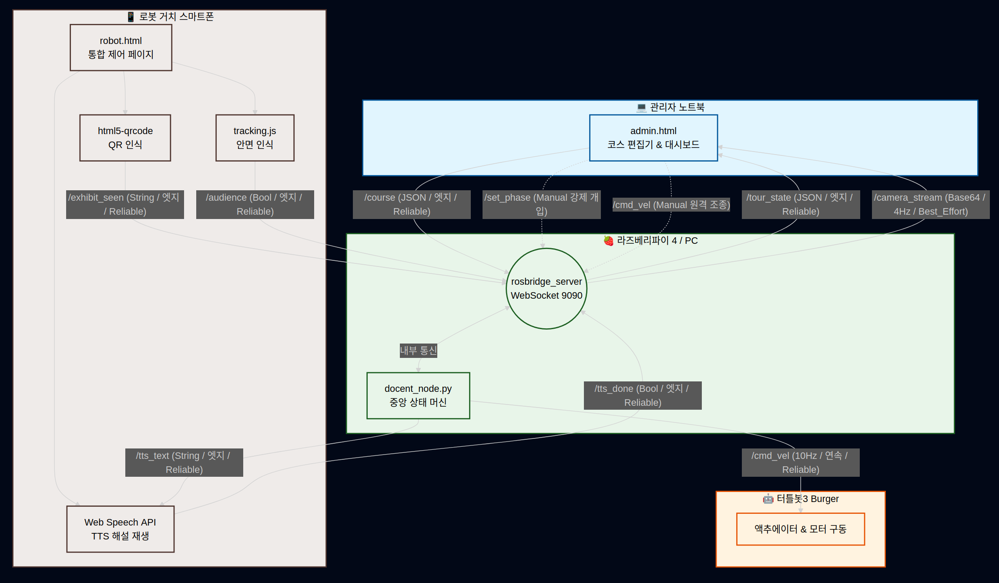

# 🤖 자율주행 AI 도슨트 로봇 시스템 계획서 — 4조

## 1. 프로젝트 개요
본 프로젝트는 **ROS 2(Humble)** 환경의 터틀봇3(Burger)와 스마트폰 센서 인프라를 웹소켓으로 융합하여, 전시관 내에서 관람객을 안내하고 작품을 해설하는 **'자율주행 AI 도슨트 로봇 시스템'** 구축을 목표로 합니다. 로봇은 주행 중 벽면에 부착된 QR 코드를 통해 자신의 위치와 전시물을 식별하며, 다단계 투어 상태머신(`MOVE` ➔ `EXPLAIN` ➔ `CHECK`)에 따라 유기적으로 거동합니다. 특히 전시물 도착 시 중앙 노드가 발행하는 엣지 명령(`/tts_text`)과 로봇 거치 폰의 웹 브라우저가 재생을 완료한 후 응답하는 이벤트 플래그(`/tts_done`)를 **'요청-완료 페어'**로 묶어 비동기 흐름을 제어합니다. 해설 종료 후 관람객 안면 인식 결과에 따른 타임아웃 예외 처리 정책을 설계하고, 관제소 웹앱을 통한 실시간 모니터링 및 코스 주입 구조를 완성하여 시스템 안정성을 확보합니다.

## 2. 기능 요구사항 (MoSCoW)
- **Must (필수 구현)**
  - **M1 [전시물 순회]:** 최소 3점 이상의 전시물 코스를 순회하며 QR 정지 오차 ±20cm 이내 구현
  - **M2 [해설 재생]:** QR 인식 즉시 정지 후, 각 20초 이상의 JSON 기반 한국어 TTS 해설 재생
  - **M3 [관람객 확인]:** 해설 종료 후 `tracking.js` 기반 얼굴 감지를 통해 관람객 확인 후 즉시 다음 이동
  - **M4 [부재 정책]:** 관람객 부재 상태가 20초간 지속될 경우 대기를 종료하고 다음 코스로 강제 이동
  - **M5 [코스 편집]:** 관리 웹앱에서 코스 순서 및 해설문 편집 시 로봇 백엔드에 즉각 반영 및 재투어 가능
  - **M6 [현황 모니터링]:** 관제 대시보드에 현재 전시물 진행 상태(현재 순서 / 전체 개수, 현재 Phase 단계) 동기화 표시
  - **M7 [안전장치]:** 웹앱 백그라운드 전환(`visibilitychange`) 시 자동 감속/정지 등 필수 안전장치 3종 탑재 및 검증

- **Should (우선 구현)**
  - **S1 [LCD 연동]:** 터틀봇 하드웨어 LCD 모듈에 현재 안내 중인 전시물 제목 실시간 표시
  - **S2 [톤 튜닝]:** Web Speech API의 재생 속도(Rate) 및 음성 선택 옵션을 제공하고 해설 대본 튜닝 전/후 기록 확보
  - **S3 [관람 통계]:** 전시물별 실제 로봇 체류 시간을 계산하여 관제탑에 기록하는 통계 기능
  - **[한계 예외 처리 ①]:** QR 코드를 인식하지 못하고 지나치는 경우를 방지하기 위한 '구간별 이동 타임아웃(30초) 정지 메커니즘' 구축
  - **[한계 예외 처리 ②]:** 투어 진행 도중 신규 `/course`가 재수신될 경우, 즉시 리셋하지 않고 현재 투어가 종료된 후 차기 투어부터 반영하는 안정화 정책 수립

- **Could (권장 구현)**
  - **C1 [추가 해설]:** 관람객 추가 질문 버튼 기능을 웹에 구현하여 전시물당 2단계(심화) 해설 스크립트 분기 재생
  - **C2 [다국어 해설]:** 웹앱 내 토글 스위치를 통한 영어(en-US) 도슨트 해설 모드 전환 기능
  - **C3 [인원 카운트]:** 감지된 얼굴 수를 카운트하여 단체 관람 시 대기 타임아웃 시간을 동적으로 연장하는 로직
  - **[경로 확장]:** 단순 직진 위주의 MOVE 상태를 구간별 회전 및 시퀀스 주행 패턴으로 확장

- **Won't (추후 구현)**
  - 동적 장애물 완전 회피를 위한 정밀 SLAM 기반 자율 내비게이션(Nav2) 패키지 연동 주행

## 3. 시스템 아키텍처


```

〔관리자 노트북 (admin.html)〕 코스 편집기 + 진행 현황 대시보드 (조장 관제)
│ /course (JSON 엣지 주입)               ▲ /tour_state (10Hz/변화시)
▼                                         │
WebSocket ─────────── rosbridge_server ───────┘
│
▼
〔라즈베리파이 4〕 docent_node (MOVE ➔ EXPLAIN ➔ CHECK) ──/cmd_vel(10Hz 연속)──▶ 터틀봇
▲ /exhibit_seen  ▲ /tts_done    ▲ /audience       │ /tts_text (해설 시작시)
│                │              │                 ▼
〔로봇 거치 스마트폰 (robot.html)〕 QR 스캔 + TTS 음성 재생 + tracking.js 얼굴 감지 (통합 페이지)

```

## 4. 사용 기술
- **Hardware:** TurtleBot3 Burger, Raspberry Pi 4 (4GB), 안드로이드/iOS 스마트폰, Ubuntu 22.04 LTS 탑재 노트북
- **Software / Framework:** ROS 2 Humble, Python 3.10, rclpy, rosbridge_suite
- **Web & AI Interface:** HTML5 Canvas, JavaScript (ES6), roslibjs, html5-qrcode.js, tracking.js (Face Detection), Web Speech API (TTS)

## 5. 역할 분담표
| 이름 | 역할 (운영 가이드 원문 기준) | 담당 범위 (실무 상세) | 주요 산출물 |
|---|---|---|---|
| **김대권** | ① 🌐 웹 프런트<br>⑥ 🔗 통합·QA<br>④ 🔩 하드웨어 (실제 수행)<br>⑤ 🎨 콘텐츠·UX (실제 수행) | 조장 총괄, 웹앱 UI 설계, roslibjs 연동 및 대시보드 구축, 전체 인터페이스 관리 및 E2E 테스트 검증 총괄, 하드웨어 구동 상태 및 도슨트 대본 콘텐츠의 실제 시스템 주입 정합성 최종 검토 | `admin.html`, 대시보드, `INTERFACE.md`, `TEST.md` |
| **여태인** | ② 🧠 AI 파이프라인<br>③ 🤖 ROS 노드<br>④ 🔩 하드웨어 (실제 수행)<br>⑤ 🎨 콘텐츠·UX (실제 수행) | ROS 2 메인 제어 노드 설계 및 다단계 상태머신 코어 로직 구현, 미인식 타임아웃 및 리셋 예외 처리 알고리즘 코딩, AI 파이프라인 연동 검증, HW 주행 경로 실측 및 작품별 해설문 콘텐츠의 데이터 매핑 설계 | `docent_node.py`, `PLAN.md`, 노드 소스, 상태 전이도 |
| **최준혁** | ② 🧠 AI 파이프라인<br>③ 🤖 ROS 노드<br>④ 🔩 하드웨어 (실제 수행)<br>⑤ 🎨 콘텐츠·UX (실제 수행) | 스마트폰 통합 페이지 내 QR 코드 스캔 및 `tracking.js` 안면 인식 파이프라인 제어 코딩, Web Speech API 기반 TTS 비동기 흐름 제어, AI 판정 로직 디바운스 필터 구현, HW 실측 및 콘텐츠 오디오 출력 최적화 튜닝 | `robot.html`, 추론 모듈, 판정 정확도 표 |
| **진승민** | 🔩 하드웨어 백업 / 회의록 지원 | 하드웨어 장비 구동 전후 단순 케이블 연결 확인 및 주변 정리 보조, 개발 일지 누적 작성을 위한 팀 회의 내용 원시 텍스트 타이핑 기록 보조 | 회의 기록 텍스트 |
| **박현상** | 🎨 콘텐츠 텍스트 검수 / 대본 정리 | 주입용 전시물 JSON 대본 텍스트의 오타 교정 및 단순 자구 수정 보조, 팀 내 마크다운 산출물 서식 정리를 위한 단순 텍스트 입력 지원 보조 | 스크립트 오타 검수 표 |

## 6. 일정 계획
- **Day 1:** 요구사항 정의, 시스템 설계, 토픽 인터페이스 합의 완료 및 전시 도면(QR 위치) 및 해설 대본 3편 초안 작성
- **Day 2:** 서브시스템 단위 개발 (웹 뼈대 구성, AI 원시 판정 검증, ROS 상태 머신 구조 파싱, HW 경로 실측)
- **Day 3:** ★ 승부처: Must 기능 완성, 웹소켓 통합 연동 실행 및 전시물 2점에 대한 E2E 자율 투어 성공 테스트 수행
- **Day 4:** 전시물 3점 확장, 코스 편집/미인식 타임아웃 예외 처리 예외 로직 구현, 대본 톤 튜닝, 무편집 리허설 촬영
- **Day 5:** 최종 시연 영상 편집, KPT 회고 및 최종 보고서(`REPORT.md`) 작성, 프로젝트 발표 및 최종 아카이브 제출

## 7. 리스크와 대응
1. **네트워크 대역폭 불안정으로 인한 CCTV 스트리밍 지연 리스크**
   - *대응안:* Base64 이미지 전송 주기를 250ms로 제한하고, Canvas 인코딩 퀄리티 파라미터를 `0.3`으로 압축하여 패킷 크기를 최소화합니다.
2. **모바일 브라우저의 오디오 정책 변경으로 인한 폰 TTS 무음 오류 리스크**
   - *대응안:* `robot.html` 상단에 사용자의 최초 터치를 강제하는 "투어 준비" 버튼을 배치하여 모바일 OS의 오디오 세션 제약 조건을 선제적으로 활성화합니다.
3. **QoS(Quality of Service) 설정 불일치로 인한 토픽 유실 리스크**
   - *대응안:* 지속 주행 명령인 `/cmd_vel`과 데이터 중요도가 높은 상태 정보 토픽들의 QoS 정책을 명확히 단일화하고, `INTERFACE.md` 규격에 맞춰 퍼블리셔와 서브스크라이버 설정을 상호 동기화합니다.

```
